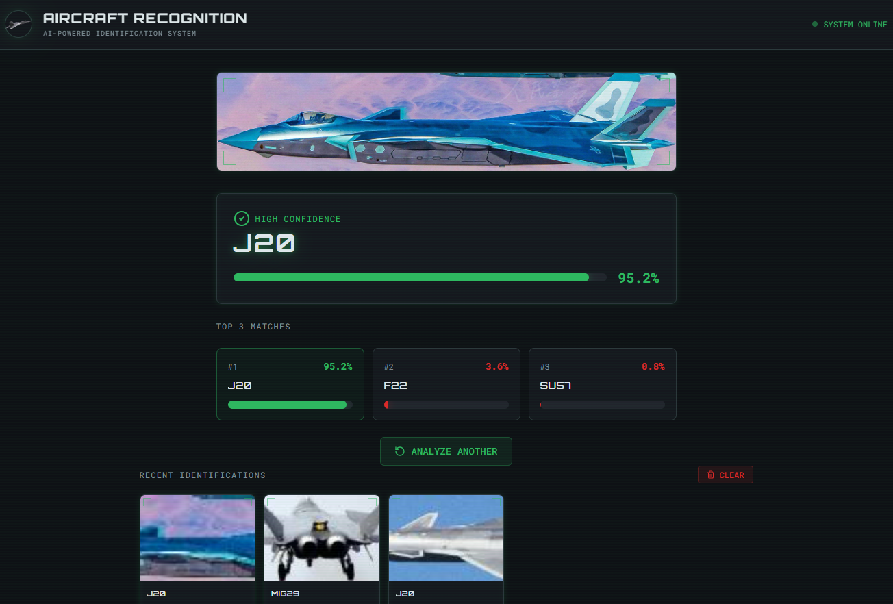

# Military Aircraft Recognition System

An AI-powered web application that identifies 81 types of military aircraft from uploaded images using deep learning and computer vision.



**🌐 Live Demo:** [https://your-app.vercel.app](https://your-app.vercel.app)  
**🚀 API Endpoint:** [https://adeel-bot-aircraft-recognition-api.hf.space](https://adeel-bot-aircraft-recognition-api.hf.space)  
**📚 API Docs:** [https://adeel-bot-aircraft-recognition-api.hf.space/docs](https://adeel-bot-aircraft-recognition-api.hf.space/docs)

---

## 📖 About

This application leverages **transfer learning with DenseNet201**, a 201-layer convolutional neural network pre-trained on ImageNet, to classify military aircraft across 81 distinct categories. The system achieves **65% accuracy** on the test set and **84% top-3 accuracy**, making it a practical tool for educational purposes and aviation enthusiasts.

### Key Features

- 🎯 **Instant Classification**: Upload an image and get predictions in under 2 seconds
- 📊 **Confidence Scores**: See prediction confidence and top-3 alternatives
- 📜 **Prediction History**: Track all your previous classifications
- 🎨 **Modern UI**: Clean, responsive interface built with Next.js and Tailwind CSS
- 🔒 **Privacy-First**: Images are not stored; processed in real-time only

---

## 🛩️ Supported Aircraft Types

The model recognizes **81 different military aircraft** across five categories:

### Fighter Jets (33 classes)
F-16 Fighting Falcon, F-35 Lightning II, F-22 Raptor, F-15 Eagle, F-18 Hornet, F-14 Tomcat, Su-27 Flanker, Su-30, Su-57, MiG-29, MiG-31, Rafale, Eurofighter Typhoon, J-10, J-20, JAS-39 Gripen, JF-17 Thunder, and more

### Bombers (6 classes)
B-2 Spirit, B-1 Lancer, B-52 Stratofortress, Tu-160 Blackjack, Tu-22M, Tu-95 Bear

### Transport Aircraft (12 classes)
C-130 Hercules, C-17 Globemaster III, C-5 Galaxy, A400M Atlas, An-124, An-225 Mriya, An-22, An-72, Il-76, C-2 Greyhound, and more

### Helicopters (15 classes)
AH-64 Apache, AH-1 Cobra, Mi-24 Hind, Mi-28, Ka-52 Alligator, T129 ATAK, CH-47 Chinook, UH-60 Black Hawk, Ka-27, and more

### UAVs & Trainers (15 classes)
MQ-9 Reaper, Bayraktar TB2, RQ-4 Global Hawk, TB-001, WZ-7, Alpha Jet, Hürkuş, and more

---

## 🎓 Dataset & Attribution

This project uses the **Military Aircraft Dataset (81 Classes)** created by **Kadir Kurtuluş** from Recep Tayyip Erdoğan University.

### Dataset Details

- **Creator**: Kadir Kurtuluş
- **Institution**: Recep Tayyip Erdoğan University, Turkey
- **LinkedIn**: [Kadir Kurtuluş](https://www.linkedin.com/in/kadirkrtls)
- **Kaggle Dataset**: [Military Aircraft Dataset (81 Classes)](https://www.kaggle.com/datasets/kadirkrtls/tez-set-v1)
- **License**: Creative Commons Attribution-ShareAlike 4.0 International (CC BY-SA 4.0)
- **Total Images**: 8,100 (100 per class, perfectly balanced)
- **Split**: 70% Training (5,670 images), 20% Test (1,620 images), 10% Validation (810 images)

**Special Thanks**: We are grateful to Kadir Kurtuluş for creating and sharing this high-quality dataset, making this educational project possible. His work on AI-based military object detection forms the foundation of this application.

---

## 🧠 Model Architecture

### Transfer Learning with DenseNet201

```
Input (224×224×3 RGB Image)
        ↓
DenseNet201 (Pre-trained on ImageNet)
├── 18.3M parameters
├── Dense connections for feature reuse
└── Global Max Pooling → 1920-dim features
        ↓
Custom Classification Head
├── Batch Normalization
├── Dropout (0.5)
├── Dense Layer (256 units, ReLU, L2 reg)
├── Dropout (0.5)
└── Output Layer (81 units, Softmax)
        ↓
Prediction (Aircraft Class + Confidence)
```

### Training Configuration

| Parameter | Value | Description |
|-----------|-------|-------------|
| **Framework** | TensorFlow 2.18 / Keras 3 | Deep learning framework |
| **Base Model** | DenseNet201 | 201-layer CNN pre-trained on ImageNet |
| **Optimizer** | Adamax (lr=0.001) | Adaptive learning rate optimizer |
| **Loss Function** | Categorical Cross-Entropy | Multi-class classification loss |
| **Regularization** | Dropout (0.5) + L2 (0.01) | Prevent overfitting |
| **Data Augmentation** | Rotation, Shift, Zoom, Flip | Improve generalization |
| **Training Platform** | Kaggle Notebooks (2× Tesla T4 GPUs) | Free GPU compute |
| **Training Time** | ~1 hour (30 epochs) | Efficient fine-tuning |

### Performance Metrics

- **Test Accuracy**: 65.06%
- **Top-3 Accuracy**: 84.32%
- **Training Accuracy**: 98.5%
- **Validation Accuracy**: 64.4%
- **Note**: The gap between training and validation accuracy indicates overfitting, a common challenge with limited data (100 images per class). Future improvements include training on the V2 dataset with 500 images per class.

---

## 🏗️ Architecture & Tech Stack

### Frontend (This Repository)

- **Framework**: Vite React
- **Language**: TypeScript
- **Styling**: Tailwind CSS
- **State Management**: React Hooks (useState, useEffect)
- **HTTP Client**: Fetch API
- **Deployment**: Vercel (Free Tier)
- **UI Components**: Custom components with Tailwind

### Backend API

- **Framework**: FastAPI (Python)
- **ML Framework**: TensorFlow 2.18 / Keras 3
- **Image Processing**: PIL (Pillow), NumPy
- **Deployment**: Hugging Face Spaces (Docker)
- **API Type**: REST API
- **Repository**: [Backend API Source](https://huggingface.co/spaces/adeel-bot/aircraft-recognition-api)

### System Architecture

```
┌─────────────────────────────────────────────────┐
│                   User Browser                  │
└────────────────────┬────────────────────────────┘
                     │
                     │ HTTPS
                     ↓
┌─────────────────────────────────────────────────┐
│        Next.js Frontend (Vercel)                │
│  - Image upload UI                              │
│  - Result display                               │
│  - Prediction history                           │
└────────────────────┬────────────────────────────┘
                     │
                     │ REST API Call (POST /predict)
                     ↓
┌─────────────────────────────────────────────────┐
│     FastAPI Backend (Hugging Face Spaces)       │
│  - Receive image                                │
│  - Preprocess (resize to 224×224)               │
│  - Run inference with DenseNet201               │
│  - Return JSON (aircraft, confidence, top-3)    │
└────────────────────┬────────────────────────────┘
                     │
                     │ Load from disk
                     ↓
           ┌──────────────────────┐
           │  Trained Model       │
           │  (251 MB .h5 file)   │
           └──────────────────────┘
```

---

## 🚀 Getting Started

### Prerequisites

- Node.js 18+ and npm
- Git

### Installation

1. **Clone the repository**
   ```bash
   git clone https://github.com/adeel-bot/aircraft-recognition-frontend.git
   cd aircraft-recognition-frontend
   ```

2. **Install dependencies**
   ```bash
   npm install
   ```

3. **Set up environment variables**
   
   Create a `.env.local` file in the root directory:
   ```env
   VITE_API_BASE_URL=https://adeel-bot-aircraft-recognition-api.hf.space
   ```

4. **Run the development server**
   ```bash
   npm run dev
   ```

5. **Open your browser**
   
   Navigate to [http://localhost:8080](http://localhost:8080)

### Building for Production

```bash
npm run build
npm start
```

---

## 📡 API Usage

### Endpoint

```
POST https://adeel-bot-aircraft-recognition-api.hf.space/predict
```

### Request

- **Content-Type**: `multipart/form-data`
- **Body Parameter**: `file` (image file - JPG, JPEG, PNG)

### Response

```json
{
  "aircraft": "F16",
  "confidence": 87.34,
  "top3": [
    {
      "aircraft": "F16",
      "confidence": 87.34
    },
    {
      "aircraft": "F18",
      "confidence": 6.21
    },
    {
      "aircraft": "F35",
      "confidence": 3.12
    }
  ]
}
```

### Example: cURL

```bash
curl -X POST https://adeel-bot-aircraft-recognition-api.hf.space/predict \
  -F "file=@/path/to/aircraft.jpg"
```

### Example: JavaScript/TypeScript

```typescript
const formData = new FormData();
formData.append('file', imageFile);

const response = await fetch(
  'https://adeel-bot-aircraft-recognition-api.hf.space/predict',
  {
    method: 'POST',
    body: formData,
  }
);

const result = await response.json();
console.log(result);
```

### Example: Python

```python
import requests

url = "https://adeel-bot-aircraft-recognition-api.hf.space/predict"
files = {"file": open("aircraft.jpg", "rb")}
response = requests.post(url, files=files)
print(response.json())
```

---

## 🎯 Project Goals & Learning Outcomes

This project was developed as an **academic capstone project** to demonstrate:

✅ **End-to-end ML pipeline**: Data collection → Preprocessing → Training → Deployment  
✅ **Transfer learning**: Leveraging pre-trained models for specialized tasks  
✅ **Full-stack development**: React frontend + FastAPI backend  
✅ **Cloud deployment**: Vercel (frontend) + Hugging Face Spaces (backend)  
✅ **API integration**: RESTful communication between services  
✅ **Real-world ML challenges**: Handling overfitting, preprocessing consistency, version compatibility

---

## 🐛 Known Limitations

- **Moderate Accuracy (65%)**: Limited by dataset size (100 images per class). Performance improves significantly on distinctive aircraft but struggles with visually similar variants.
- **Confusion on Similar Aircraft**: Model sometimes confuses aircraft with similar designs (e.g., Su-27 ↔ F-15, MiG-29 ↔ MiG-31).
- **Overfitting**: High training accuracy (98.5%) vs. validation (64.4%) indicates model memorization. Future work includes training on larger datasets.
- **Image Quality Dependency**: Performance degrades on low-quality, heavily occluded, or extreme-angle images.
- **No Real-time Video**: Currently supports single-image classification only.

---

## 🛠️ Future Enhancements

- **Larger Dataset**: Retrain on V2 dataset (500 images per class)
- **Ensemble Methods**: Combine multiple models for improved accuracy
- **Confidence Thresholding**: Flag uncertain predictions for user review
- **Aircraft Information Database**: Display specifications, history, and facts
- **Comparison Mode**: Upload multiple images for side-by-side comparison
- **Mobile App**: React Native version for iOS/Android
- **User Feedback Loop**: Collect corrections to improve future models
- **Multi-language Support**: Internationalization for global users

---

## 📄 License

This project is licensed under the **MIT License** - see the [LICENSE](LICENSE) file for details.

**Dataset License**: The underlying dataset is licensed under **CC BY-SA 4.0** by Kadir Kurtuluş. Any derivative works must provide appropriate attribution.

---

## 🙏 Acknowledgments

### Dataset Creator
- **Kadir Kurtuluş** - For creating and sharing the Military Aircraft Dataset
  - LinkedIn: [Kadir Kurtuluş](https://www.linkedin.com/in/kadirkrtls)
  - Kaggle: [kadirkrtls](https://www.kaggle.com/kadirkrtls)
  - Institution: Recep Tayyip Erdoğan University

### Frameworks & Tools
- **DenseNet**: Huang et al. (2017) for the DenseNet architecture
- **TensorFlow/Keras**: Google Brain team
- **Next.js**: Vercel team
- **Hugging Face**: For free ML model hosting
- **Kaggle**: For free GPU compute during training

### Inspiration
This project was inspired by the need for accessible AI-powered tools in aviation education and the growing importance of computer vision in defense applications.

---

## 👨‍💻 Author

**[Your Name]**  
- GitHub: [@adeel-bot](https://github.com/adeel-bot)
- LinkedIn: [adeel-bot](https://www.linkedin.com/in/adeel-bot)
- Email: adeelthebuilder@gmail.com

**Academic Institution**: [Government College University Faisalabad]  
**Program**: [Software Engineering]  
**Date**: February 2026

---

## 📞 Contact & Support

For questions, suggestions, or collaboration:
- Open an issue on [GitHub](https://github.com/adeel-bot/aircraft-recognition-frontend/issues)
- Email: adeelthebuilder@gmail.com

---

## ⭐ Show Your Support

If you found this project helpful or interesting:
- Give it a ⭐ on GitHub
- Share it with fellow aviation enthusiasts
- Contribute improvements via pull requests

---

**Disclaimer**: This is an educational project developed for learning purposes. While functional, it should not be used for mission-critical military or defense applications without extensive validation and testing. Model predictions should be verified by domain experts.

---

Made with ❤️ for aviation and AI